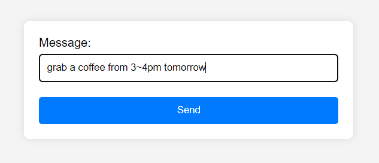

# 使用ChatGPT进行谷歌日历自动化
经常使用谷歌日历的朋友们都知道，在添加日历时间的时候，有很多项需要填写，比如事件摘要，起止时间，时区等。这极大地阻碍了异地情侣们同步时间表的难度。本项目通过大语言模型的接入来实现谷歌日历中事件的自动添加，您只需在网页中通过自然语言对想要添加的事件进行描述，LLM就会自动帮您在指定的谷歌账号中转换并添加想要的事件。

## 如何使用
1. 首先您需要拥有一台服务器，并将本仓库clone到服务器端。
2. 这里的LLM使用了openAI的gpt-3.5-turbo模型，因此需要您自行注册openAI的API key，并添加到`prompt_gpt.py`中的`openaiKey = 'your-openai-api-key'`这一行中。您可在[这里](https://beta.openai.com/signup)中注册API key。
3. 启用Google API和Google Calendar项目，参见[这里](https://developers.google.com/calendar/api/quickstart/python?hl=zh-cn)。您需要根据教程完成【前提条件】，【设置您的环境】，和【安装 Google 客户端库】中的全部步骤。（您需要将刚刚生成的OAuth 2.0 客户端 ID放置到项目目录中，并重命名为`client_secret_calendar.json`）
4. 使用`pip install -r requirements.txt`来安装环境依赖。
5. 调试：运行`python app.py`
6. 部署：运行`nohup python app.py`，将后端程序转到后台运行。

最后，在网页中输入`http://<your-server-ip-address>:<port-number>`，将此处的url替换成您服务器的ip地址和端口，即可访问应用的网页。ip地址和端口信息通常会在运行`app.py`时注明。此时，您只需在输入框中输入想要AI帮忙添加的事件描述即可。

## 注意
1. 程序在第一次运行时会跳转网页，并要求您进行对应Google账号的登录。此操作只会出现一次。
2. 此网页同时适配PC和移动端。
3. 本项目并未提供服务器端的加密，用户可自行添加。